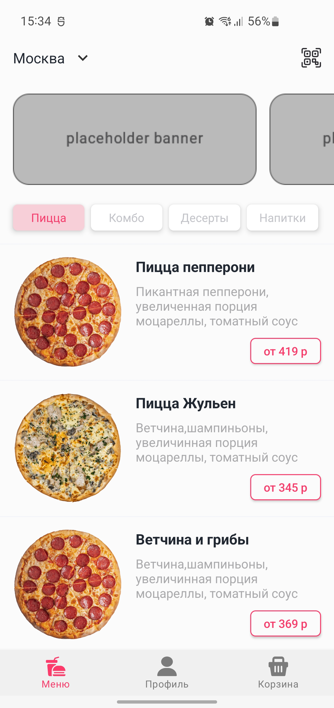
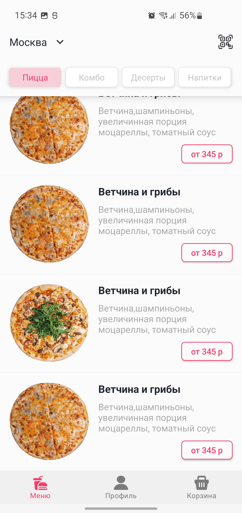

# Hammer Systems Test Task

Тестовое задание от компании Hammer Systems. Задачей было реализовать приложение для пиццерии, с баннерами, категориями и списком товаров с тестового апи, по готовому дизайну, схожему с приложением Додо пиццы. Для запросов я использовал Retrofit с корутинами, изображения получал через Picasso.

## Стек:
 - Kotlin
 - MVVM
 - Clean Architecture
 - LiveData
 - Hilt
 - Room
 - OkHttp3
 - Retrofit2
 - Picasso
## Скриншоты

